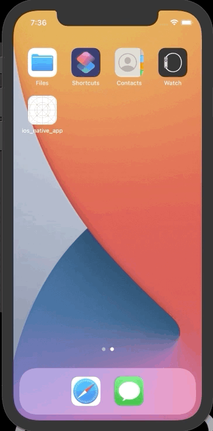

# Configuration Flutter Module in Native App (iOS and Android) and Create Method Channel


## Folder Tree
```
./repository
./repository/android_native_app
./repository/ios_native_app
./repository/flutter_app
```

## Creating Flutter Module
```shell
$ flutter create -t module flutter_app
$ cd flutter_app
$ flutter pub get
```

### 1. Using method Channel in Flutter App
```dart
class _MyHomePageState extends State<MyHomePage> {

  static const platform = const MethodChannel('com.example.androidnativeapp/navigate');

  [...]
 
  Widget build(BuildContext context) {
    [...]

    onPressed: () async => await platform.invokeMethod("pop")),   
     
    [...]
  }

  [...]
}

```

# Configuration Android

### 1. In Settings.gradle
```gradle
[...]

setBinding(new Binding([gradle:this]))
evaluate(new File(
        settingsDir.parent,
        'flutter_app/.android/include_flutter.groovy'
))

include ':flutter_app'
project(':flutter_app').projectDir = new File('../flutter_app')
```
### 2. In app/build.gradle
```gradle
[...]

android {
    [...]

    compileOptions {
        sourceCompatibility JavaVersion.VERSION_1_8
        targetCompatibility JavaVersion.VERSION_1_8
    }

    [...]
}

dependencies {
    [...]

    implementation project(':flutter')
}
```
### 3. In app/src/main/AndroidManifest.xml
```xml
[...]

<activity android:name=".CustomFlutterActivy"></activity>

<activity
    android:name="io.flutter.embedding.android.FlutterActivity"
    android:configChanges="orientation|keyboardHidden|keyboard|screenSize|locale|layoutDirection|fontScale|screenLayout|density|uiMode"
    android:hardwareAccelerated="true"
    android:windowSoftInputMode="adjustResize" />

[...]
```

### 4. Create button in xml to call flutter app - app/src/main/res/layout/activity_main.xml
```xml
<Button
    android:id="@+id/button"
    android:layout_width="wrap_content"
    android:layout_height="wrap_content"
    android:text="Show Flutter"
    tools:layout_editor_absoluteX="131dp"
    tools:layout_editor_absoluteY="388dp" />
```

### 5. In app/src/main/(kolin|java)/package/name/MainActivity.kt
```kotlin
import androidx.appcompat.app.AppCompatActivity
import android.os.Bundle
import android.widget.Button
import io.flutter.embedding.engine.FlutterEngine
import io.flutter.embedding.engine.FlutterEngineCache
import io.flutter.embedding.engine.dart.DartExecutor

class MainActivity : AppCompatActivity() {
    override fun onCreate(savedInstanceState: Bundle?) {
        super.onCreate(savedInstanceState)
        setContentView(R.layout.activity_main)


        /**----------------Configuration Flutter---------------*/
        val flutterEngine = FlutterEngine(this)
        flutterEngine.dartExecutor.executeDartEntrypoint(
            DartExecutor.DartEntrypoint.createDefault()
        )

        FlutterEngineCache
            .getInstance()
            .put("my_engine_id", flutterEngine)


        var button = findViewById<Button>(R.id.button)
        button.setOnClickListener {

            val intent = CustomFlutterActivy
                .withCachedEngine("my_engine_id")
                .build(this@MainActivity)
            startActivity(intent)

        }
        /**---------------------------------------------------*/
    }
}
```
### 6. Create File in app/src/main/(kolin|java)/package/name/CustomFlutterActivy.kt
```kotlin
import androidx.annotation.NonNull
import io.flutter.embedding.android.FlutterActivity
import io.flutter.embedding.engine.FlutterEngine
import io.flutter.embedding.engine.FlutterEngineCache
import io.flutter.plugin.common.MethodChannel


class CustomFlutterActivy: FlutterActivity() {
    private val CHANNEL = "com.example.androidnativeapp/navigate"

    companion object {
        fun withCachedEngine(engineId: String) = CustomCachedEngineIntentBuilder(engineId)
    }

    class CustomCachedEngineIntentBuilder(engineId: String) :
        CachedEngineIntentBuilder(CustomFlutterActivy::class.java, engineId)

    override fun onResume() {
        super.onResume()
        MethodChannel(
            FlutterEngineCache.getInstance()["my_engine_id"]!!.dartExecutor
                .binaryMessenger, CHANNEL
        )
            .invokeMethod("notifyNavToFlutter", intent.getStringExtra("screen"))
    }


    override fun configureFlutterEngine(@NonNull flutterEngine: FlutterEngine) {
        super.configureFlutterEngine(FlutterEngineCache.getInstance()["my_engine_id"]!!)
        MethodChannel(flutterEngine.dartExecutor.binaryMessenger, CHANNEL).setMethodCallHandler {
                call, result ->
            if(call.method == "pop") {
                this@CustomFlutterActivy.finish()
            } else {
                result.notImplemented()
            }
        }
    }
}
```

---

# Configuration iOS

### 1. Generete Podfile for dependencies if not exists
```shell
cd ./repository/ios_native_app
pod init
```
>After "Podfile" is generated

### 2. Add Flutter Dependencies in Podfile
```gradle
[...]

  ########### Add Flutter to Dependencies iOS Project #########

  flutter_application_path = '../flutter_app'
  load File.join(flutter_application_path, '.ios', 'Flutter', 'podhelper.rb')
  install_all_flutter_pods(flutter_application_path)

  #############################################################

[...]
```

### 3. After Podfile configurate, run pod install
```shell
$ pod install
```

### 4. In ios_native_app/ViewController.swift (or you ViewController)
```swift
import UIKit
import Flutter

class ViewController: UIViewController {    
    var methodChannel : FlutterMethodChannel?
    override func viewDidLoad() {
        super.viewDidLoad()
        initMethodChannel()
        buildLayout()
    }
}

/** Creating Button and func showFlutter, call FlutterViewController*/
extension ViewController {
    func buildLayout() {
        let button = UIButton(type:UIButton.ButtonType.custom)
        button.addTarget(self, action: #selector(showFlutter), for: .touchUpInside)
        button.setTitle("Show Flutter!", for: UIControl.State.normal)
        button.frame = CGRect(x: 80.0, y: 210.0, width: 160.0, height: 40.0)
        button.backgroundColor = UIColor.blue
        self.view.addSubview(button)
    }
    
    @objc func showFlutter() {
        if let flutterEngine = (UIApplication.shared.delegate as? AppDelegate)?.flutterEngine {
            let flutterViewController = FlutterViewController(engine: flutterEngine, nibName: nil, bundle: nil)
            flutterViewController.modalPresentationStyle = .fullScreen
            self.present(flutterViewController, animated: true, completion: nil)
            
        }
    }
}

/** Platform Channel method example */
extension ViewController {
    func initMethodChannel() {
        if let flutterEngine = (UIApplication.shared.delegate as? AppDelegate)?.flutterEngine {
            methodChannel = FlutterMethodChannel(
                name: "com.example.androidnativeapp/navigate", 
                binaryMessenger: flutterEngine.binaryMessenger
            )
            methodChannel?.setMethodCallHandler({ [weak self]
                (call: FlutterMethodCall, result: @escaping FlutterResult) -> Void in
                if self != nil {
                    switch(call.method) {
                    case "pop":
                        self?.dismiss(animated: true, completion: nil)
                        break;
                    default:
                        print("Unrecognized method name: \(call.method)")
                    }
                }
            })
        }
    }
}

```

# Result

 